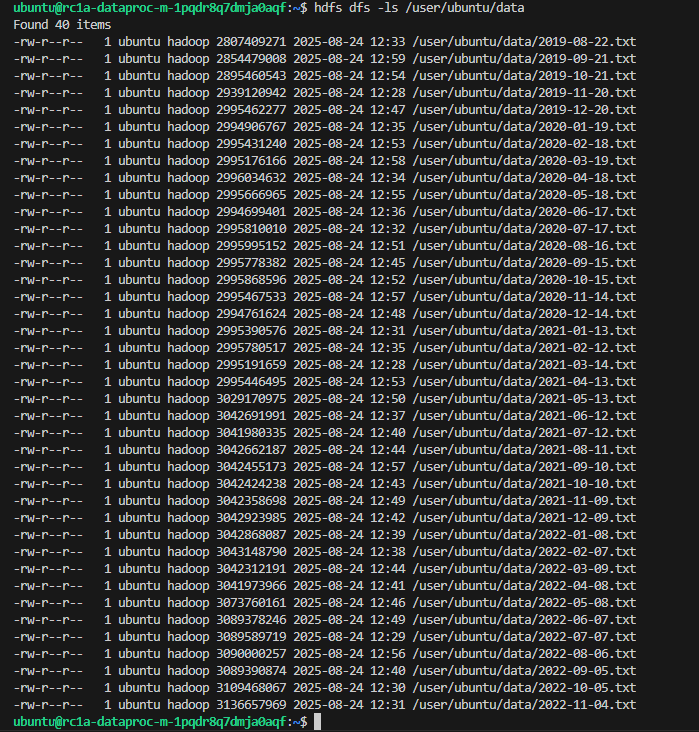

# Домашнее задание №2  
## Настройка облачной инфраструктуры для проекта по определению мошеннических транзакций
## Кластер Yandex Data Processing

Spark-кластер должен иметь следующие характеристики:

- Мастер-подкластер: класс хоста `s3-c2-m8`, размер хранилища 40 ГБ  
- Data-подкластер: класс хоста `s3-c4-m16`, 3 хоста, размер хранилища 128 ГБ

## Задания

1. Создать новый bucket в Yandex Cloud Object Storage с помощью Terraform-скрипта:

https://github.com/CristianMachucaMendoza/Otus-Machuka-Projects/blob/main/infra/main.tf

2. Скопировать содержимое предоставленного хранилища с помощью инструмента `s3cmd`:

https://storage.yandexcloud.net/otus-machuca-bucket-b1gjlbg9jdvuumq3kui1/

https://github.com/CristianMachucaMendoza/Otus-Machuka-Projects/blob/main/infra/scripts/user_data.sh

3. Создать Spark-кластер в Yandex Data Processing с двумя подкластерами согласно характеристикам:

https://github.com/CristianMachucaMendoza/Otus-Machuka-Projects/blob/main/infra/main.tf

4. Подключиться по SSH к мастер-узлу и выполнить команду копирования содержимого хранилища в файловую систему HDFS с помощью `hadoop distcp`. 

https://github.com/CristianMachucaMendoza/Otus-Machuka-Projects/blob/main/infra/scripts/upload_data_to_hdfs.sh

5. Оценить месячные затраты на поддержание кластера, используя тарифный калькулятор Yandex Cloud. Сравнить стоимость содержания HDFS vs объектного хранилища.