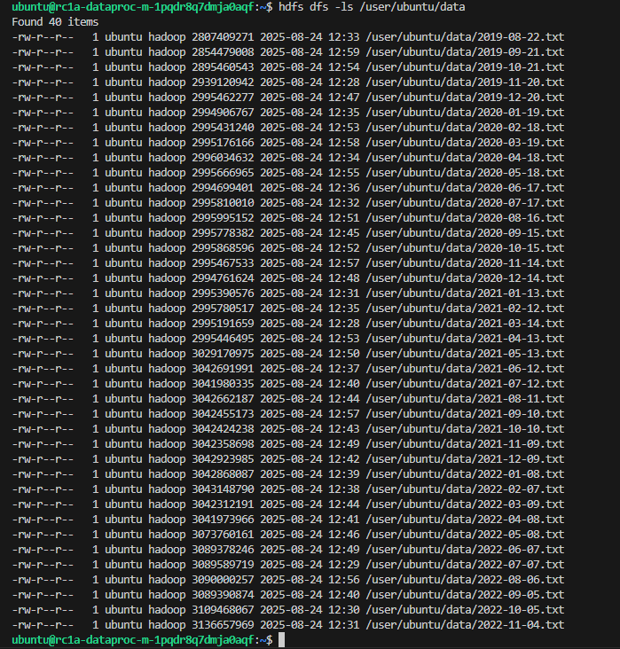

# Домашнее задание №2  
## Настройка облачной инфраструктуры для проекта по определению мошеннических транзакций
## Кластер Yandex Data Processing

Spark-кластер должен иметь следующие характеристики:

- Мастер-подкластер: класс хоста `s3-c2-m8`, размер хранилища 40 ГБ  
- Data-подкластер: класс хоста `s3-c4-m16`, 3 хоста, размер хранилища 128 ГБ

## Задания

1. Создать сервисный аккаунт в Yandex Cloud для работы с кластером Yandex Data Processing и предоставить ему необходимые роли:

https://github.com/CristianMachucaMendoza/Otus-Machuka-Projects/blob/homework3/infra/main.tf

2. Создать новый bucket в Yandex Cloud Object Storage и предоставить созданному выше системному аккаунту право на запись к нему. Для проверки преподавателем данный bucket необходимо сделать общедоступным на чтение, а точку доступа к нему привести в README-файле Вашего GitHub-репозитория.:

https://storage.yandexcloud.net/otus-machuca-bucket-b1gjlbg9jdvuumq3kui1/

3. Создать Spark-кластер в Yandex Data Processing, указав в настройках созданный выше bucket, с двумя подкластерами согласно указанным характеристикам.:

https://github.com/CristianMachucaMendoza/Otus-Machuka-Projects/blob/homework3/infra/main.tf

4. Проанализировать датасет мошеннических транзакций на наличие в нем ошибочных данных. Данное действие рекомендуется выполнять с помощью среды Jupyter Notebook, запущенной на мастер-узле кластера. Нужно оценить, какие из основных проблем с данными могут иметь место в рассматриваемом датасете, и постараться выявить факт их наличия, колонки, которые они затрагивают, объем некорректных данных и т.д.. 

https://github.com/CristianMachucaMendoza/Otus-Machuka-Projects/blob/homework3/notebooks/Spark-data-analyisis.ipynb

5. Создать скрипт очистки данных на основе проведенного анализа качества с использованием Apache Spark. Скрипт должен иметь возможность автоматического запуска внешней системой.

https://github.com/CristianMachucaMendoza/Otus-Machuka-Projects/blob/homework3/infra/scripts/process_data_by_one.py

5. Выполнить очистку датасета с использованием созданного скрипта и сохранить его в созданном выше bucket'е в формате parquet, подходящем для хранения большого объема структурированных данных.

https://github.com/CristianMachucaMendoza/Otus-Machuka-Projects/blob/homework3/infra/scripts/send_parquet_to_s3.sh

# Домашнее задание №2  
## Настройка облачной инфраструктуры для проекта по определению мошеннических транзакций
## Кластер Yandex Data Processing

Spark-кластер должен иметь следующие характеристики:

- Мастер-подкластер: класс хоста `s3-c2-m8`, размер хранилища 40 ГБ  
- Data-подкластер: класс хоста `s3-c4-m16`, 3 хоста, размер хранилища 128 ГБ

## Задания

1. Создать новый bucket в Yandex Cloud Object Storage с помощью Terraform-скрипта:

https://github.com/CristianMachucaMendoza/Otus-Machuka-Projects/blob/main/infra/main.tf

2. Скопировать содержимое предоставленного хранилища с помощью инструмента `s3cmd`:

https://storage.yandexcloud.net/otus-machuca-bucket-b1gjlbg9jdvuumq3kui1/

https://github.com/CristianMachucaMendoza/Otus-Machuka-Projects/blob/main/infra/scripts/user_data.sh

3. Создать Spark-кластер в Yandex Data Processing с двумя подкластерами согласно характеристикам:

https://github.com/CristianMachucaMendoza/Otus-Machuka-Projects/blob/main/infra/main.tf

4. Подключиться по SSH к мастер-узлу и выполнить команду копирования содержимого хранилища в файловую систему HDFS с помощью `hadoop distcp`. 

https://github.com/CristianMachucaMendoza/Otus-Machuka-Projects/blob/main/infra/scripts/upload_data_to_hdfs.sh

5. Оценить месячные затраты на поддержание кластера, используя тарифный калькулятор Yandex Cloud. Сравнить стоимость содержания HDFS vs объектного хранилища.

Итоговая стоимость хранения ~100 ГБ данных в Yandex Object Storage составляет примерно 217 ₽ в месяц (без учета операций и трафика, которые в разумных пределах бесплатны).
В то же время, содержание кластера HDFS из трех хостов с 120 ГБ дискового пространства будет стоить примерно 22 262 ₽ в месяц, включая аренду вычислительных ресурсов и дискового пространства.
для задач, где важна простота, масштабируемость и минимальные затраты на инфраструктуру, объектное хранилище Yandex Cloud является оптимальным выбором. В свою очередь, кластер HDFS лучше подходит для сценариев с интенсивной обработкой больших объемов данных в реальном времени, обеспечивая высокую скорость чтения и записи. Однако его содержание требует значительных затрат на вычислительные ресурсы и поддержку. Таким образом, выбор между HDFS и объектным хранилищем должен основываться на конкретных требованиях к производительности, стоимости и удобству обслуживания: объектное хранилище выгодно для архива и долговременного хранения, а HDFS — для оперативной обработки и аналитики больших данных.

